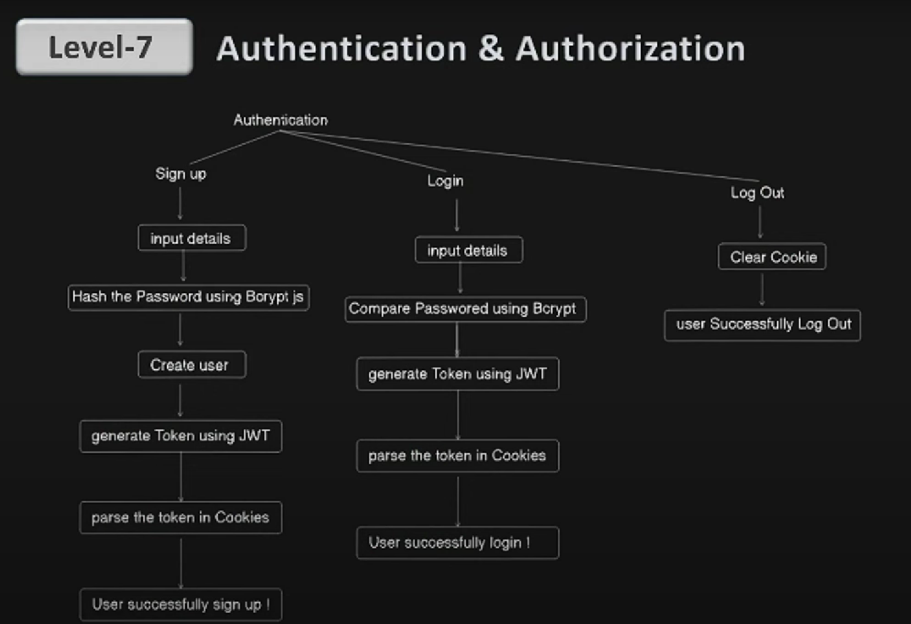

# LinkSphere

A full-stack MERN Project (MongoDB, Express, React, Node.js) stack.

## 🚀 Features

- User registration and login (authentication)
- Create and edit profile (bio, skills, profile picture, experience, education)
- Connect with other users (send/accept connection requests)
- Post updates, like, and comment
- Real-time chat messaging
- Search users and posts
- Responsive design

## 🛠️ Tech Stack

**Frontend:**

- React.js
- Redux (if used)
- TailwindCSS / Bootstrap

**Backend:**

- Node.js
- Express.js
- MongoDB + Mongoose

**Other Tools:**

- JWT for authentication
  ** npm install jsonwebtoken**
  
- Multer / Cloudinary for file uploads
- Socket.IO for real-time messaging (optional)

## 📁 Folder Structure

```bash
LinkSphere/
├── backend/
│   ├── models/
│   ├── routes/
│   ├── controllers/
│   ├── server.js
│   └── config/
├── frontend/
│   ├── src/
│   │   ├── components/
│   │   ├── pages/
│   │   └── App.js
└── README.md
```
